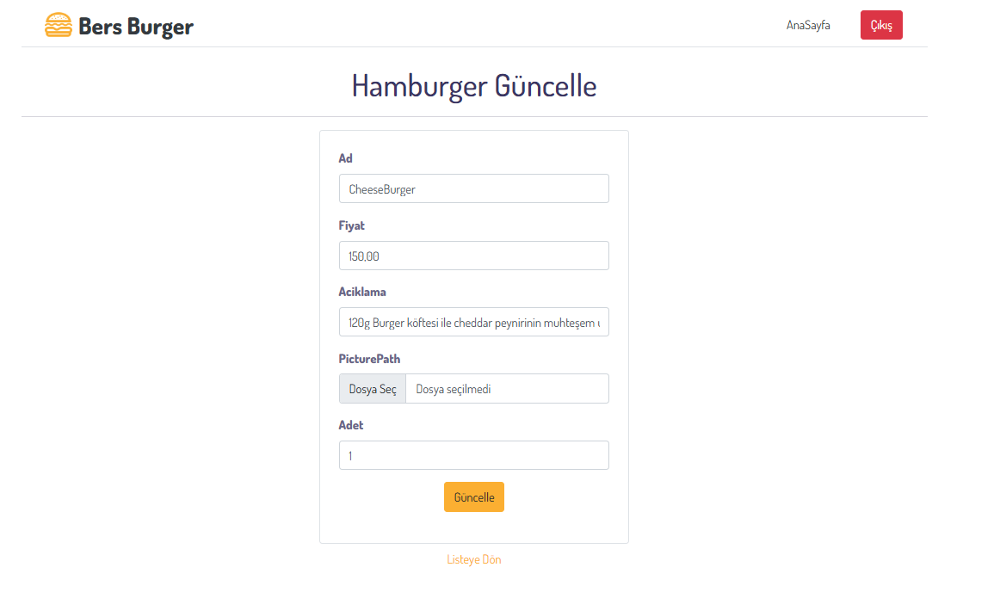

# MVC Restoran Sipariş Yönetim Sistemi 🍽️ BERS Burger
### Bu proje, bir restoranın sipariş yönetimini sağlayan bir ASP.NET Core MVC uygulamasıdır. Uygulama, Identity ile yönetici ve müşteri rollerini destekler.
## Özellikler 🚀
### Yetkilendirme & Kimlik Doğrulama 🔐
<ul>
  <li>Yönetici rolü: Menü ve ekstra malzemeleri yönetebilir.</li>
  <li>Müşteri rolü: Sipariş oluşturabilir, güncelleyebilir ve silebilir</li>
</ul>

### Menü Yönetimi 📜
<ul>
  <li>Yönetici, menüleri listeleyebilir, ekleyebilir, güncelleyebilir ve silebilir.</li>
</ul>

### Ekstra Malzeme Yönetimi 🧀
<ul>
  <li>Yönetici, ekstra malzemeleri listeleyebilir, ekleyebilir, güncelleyebilir ve silebilir.</li>
</ul>

### Sipariş Yönetimi 🛒
<ul>
  <li>Müşteriler, siparişleri listeleyebilir, ekleyebilir, güncelleyebilir ve silebilir.</li>
</ul>

## Teknolojiler 🏗️
<ul>
  <li>ASP.NET Core MVC</li>
  <li>Entity Framework Core</li>
  <li>Identity</li>
  <li>SQL Server</li>
  <li>Bootstrap 5</li>
</ul>

